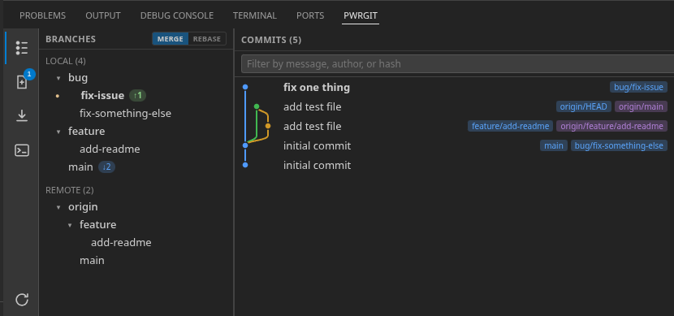

# pwrgit

A Git tool window for VS Code, living in the **bottom panel**. A single
integrated view: branch explorer on the left, a colored commit graph on the right, plus
a working-tree Changes view and a raw command Console — all driven by direct `git` calls.

> Status: early but functional (`v1.0.0`). Built for day-to-day local Git work.

## Layout



## Features

### Commit graph (Git Log view)
- **Refs explorer** grouped into Local / Remote / **Tags**. Refs whose names contain `/`
  are organized into **collapsible folders** (like a file tree); each leaf shows only its
  final segment, and double-clicking a folder expands/collapses it. The current branch is marked.
- **Incoming/outgoing badges** per branch — `↓N` behind, `↑N` ahead (blue/green). Unpushed
  branches show outgoing counts relative to all remotes.
- **Commit graph** with lane assignment and colored bezier edges (merges converge, branches
  fork). Each commit shows its ref badges — **local branches in blue, remotes in purple,
  tags in grey** — alongside author and relative date.
- **Multi-select & squash:** Shift- or Ctrl/⌘-click to select multiple commits, then
  right-click the selection to **squash** them into a single commit.
- **Filtering:** double-click a branch **or tag** to scope the log to it (double-clicking a
  folder just collapses/expands it); free-text search by commit **message, author, or hash**;
  a Clear button resets both. Filters survive auto-refresh.
- **Commit limit:** set how many commits to load via the input in the Commits header; a
  **Load more** row appears when older history remains.

### Diffs
- Click a commit → its **changed files** appear in the right pane.
- Click a file → native VS Code **diff** (commit vs. its first parent) via a `pwrgit-diff:`
  content provider.

### Changes view (working tree)
- Status grouped into **Changes** / **Unversioned Files** with checkboxes.
- **Commit** the checked files; split button offers **Commit** / **Commit and Push**.
- **Amend** checkbox prefills the previous commit message (and restores your draft on
  uncheck); the message box is never cleared automatically.
- **Rollback** the checked files ("Rollback changes to N files"), or a single file via its
  context menu.
- **Stash** the checked files (uses the commit message as the stash name if present). A
  **Stashes** tab lists saved stashes with **Apply / Pop / Drop**.
- Click a file → **working-tree diff** against HEAD.
- A change-count badge shows on the Changes icon.

### Context menu actions
- **Branch:** Checkout · New Branch · Fetch · Pull · Update (fast-forward a non-current
  branch to its upstream) · Push · Force Push (`--force-with-lease`) · Merge into current
  · Rebase current onto · Rename · Delete.
- **Commit:** Checkout (detached) · New Branch from here · Create Tag Here · Cherry-pick ·
  Revert · Reset soft/mixed/hard · Copy Revision Number · Copy Message.
- **Tag:** Checkout · New Branch from tag · Push Tag · Delete Tag.
- A **Merge / Rebase** toggle in the Branches header controls whether **Pull** uses
  `git pull` or `git pull --rebase` (persisted).
- Destructive actions (delete, hard reset, force push, rollback) require confirmation.

### Console
- Every UI-triggered git command is logged with its `stdout`/`stderr`, like a terminal —
  handy for understanding and debugging what ran. Failures turn red and raise an error dot
  on the Console icon.

### Live updates
- Filesystem watchers on the git directory (`HEAD`, `refs`, `index`, …) and the working
  tree keep the panel in sync with changes made from the terminal or elsewhere, debounced
  to coalesce bursts. A manual **Refresh** action (rail bottom) is always available.

## Getting started (development)

Requirements: Node 18+ and VS Code 1.90+.

```sh
npm install
# npm 9+ blocks native install scripts; approve esbuild's if prompted:
npm install-scripts approve esbuild   # then: npm install-scripts run
npm run build
```

Then press **F5** in VS Code (uses `.vscode/launch.json`) to open an Extension Development
Host. Open any Git repository, and the **pwrgit** tab appears in the bottom panel next to
Terminal/Problems.

For iterative work: run the `npm: watch` task, press F5 once, and reload the Ext Host with
`Ctrl+R` after edits.

### Testing

```sh
npm test        # Node's built-in test runner over test/**/*.test.ts
```

Tests cover the pure logic — commit-graph lane assignment (`src/graph.ts`) and branch-name
sanitising (`src/branch.ts`). They run the `.ts` sources directly, so they need a Node build
with native TypeScript support (Node ≥ 22.18 or ≥ 23.6).

## Packaging

```sh
npm run package         # builds (production) and writes pwrgit-<version>.vsix
```

Install the `.vsix` via **Extensions: Install from VSIX…** in VS Code. To publish to the
Marketplace, set your real `publisher`/`repository` in `package.json`, then `npm run publish`
(requires a Personal Access Token; the `keytar` and `@vscode/vsce-sign` install scripts are
only needed for publishing/signing).

## Architecture

| Path | Responsibility |
|------|----------------|
| `src/extension.ts` | Extension host: `WebviewViewProvider`, message routing, git actions, `pwrgit-diff:` content provider, filesystem watchers. |
| `src/git.ts` | Git service — all `git` invocations via `child_process` (branches, log, status, diff, blob content, push, etc.). |
| `src/graph.ts` | Commit-graph lane assignment (`buildGraph`). |
| `src/branch.ts` | Branch-name sanitising (whitespace → hyphens) for new branches. |
| `media/main.js` | Webview UI: rendering, interactions, message passing. |
| `media/style.css` | Webview styling (uses VS Code theme variables). |
| `test/` | Unit tests via `node:test` — `graph.test.ts`, `branch.test.ts`. |

**Why raw `git`?** The commit graph needs parent topology (`%P`) and precise `--format`
control the built-in Git extension API doesn't expose.

## Roadmap

See [TODO.md](./docs/TODO.md) for the planned work and known limitations.

## License

MIT
